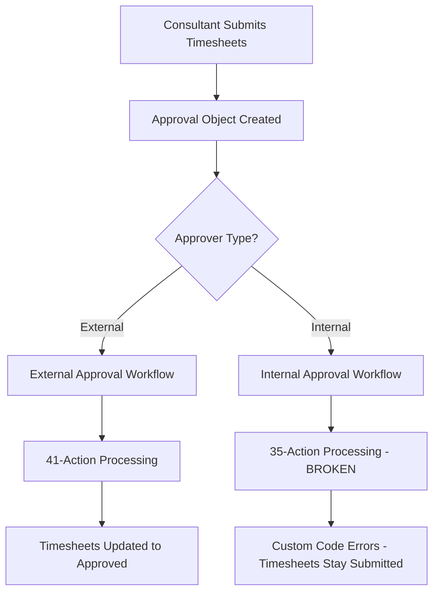

# 📋 Timesheet Submission and Approval Process

## Overview

This document maps the complete timesheet submission and approval process, identifying the differences between external and internal approval paths, and documenting the issues and solutions implemented.

## 🔄 Process Flow Overview

## 📊 Component Mapping

### 🎯 Step 1: Timesheet Submission

**Module:** `hjp-line-items-approval-01.module`
- **Purpose:** Consultant submits timesheets for approval
- **Form ID:** `5dd64adc-00b2-4cfa-a69f-4cb068c5c55f`
- **Target Object:** `2-26103010` (HJ Approval) ✅ **Fixed 09/11/2025**
- **Key Fields:**
  - `response_approval_timesheet_ids_array` - Array of timesheet record IDs
  - `response_approval_project_id` - Project identifier
  - `response_approval_customer` - Customer name
  - `response_approval_consultant_name` - Consultant name
  - `response_approval_from_date` / `response_approval_until_date` - Date range

**Previous Issue:** Was targeting contacts (`0-1`) instead of approval objects, causing empty approval objects.

### 🎯 Step 2: Approval Notification

**Process:** 
- Email sent to approver with approval URL
- URL contains project parameters and approver type

**URL Patterns:**
- **External:** `/field-ticket-for-approval-step-01?...&approver_is=PrimaryContact`
- **Internal:** `/hj-field-ticket-for-approval-step-01?...&approver_is=HJPetro`

### 🎯 Step 3A: External Approval Response (WORKING ✅)

**Module:** `hjp-field-ticket-for-approval-01.module`
- **Form ID:** `31f4d567-ae0d-4ed2-8d4d-9701b127753a`
- **Target Object:** `2-26103010` (HJ Approval) ✅ **Fixed 09/11/2025**
- **Workflow:** `1680618036` - "21. Customer Approval Response (Approval)"
- **Actions:** 41 total actions
- **Status:** ✅ **Working correctly**

**Key Actions:**
1. Update approval object status
2. Update timesheet objects (Submitted → Approved)
3. Branch logic (Approve/Reject paths)
4. PDF generation webhook
5. Email notifications
6. Deal note creation
7. Error handling and cleanup

### 🎯 Step 3B: Internal Approval Response (BROKEN ❌)

**Module:** `hjp-h-and-j-field-ticket-for-approval-01.module`
- **Form ID:** `31f4d567-ae0d-4ed2-8d4d-9701b127753a` (**Same as external**)
- **Target Object:** `2-26103010` (HJ Approval) ✅ **Fixed 09/11/2025**
- **Workflow:** `1682422902` - "26. H&J Approval Response (Approval)"
- **Actions:** 35 total actions (**Missing 6 critical actions**)
- **Status:** ❌ **Partially working - custom code errors**

**Missing Actions (compared to external):**
- Action 23: Error tracking (`webbook_error = "yes"`)
- Actions 24-26: PDF generation webhook sequence
- Actions 46-48, 51: Additional processing and cleanup

**Current Issues:**
- Actions 14 & 16 fail due to missing date fields in approval objects
- Incomplete processing due to missing actions

### 🎯 Step 4: PDF Generation (Identified Issue)

**Form ID:** `f64e8d49-a3de-4d03-96c8-38e513246fa9`
- **Purpose:** Generate consultant field ticket PDFs
- **Fields:** `consultant_field_ticket_pdf___01` through `___05`
- **Issue:** Targets inactive copy of workflow 26
- **Created:** March 18, 2024
- **Last Submission:** September 11, 2025

### 🎯 Step 5: Re-Approval Process

**Module:** `hjp-line-items-approval-re-01.module`
- **Form ID:** `f45d58de-38c3-441e-b344-2e6c6187b272`
- **Target Object:** `0-1` (Contacts) ❌ **Still broken**
- **Purpose:** Re-submission after rejection
- **Status:** ❌ **Needs same fix as main submission**

## 🚨 Root Cause Analysis

### Historical Context
- Originally both processes used contact-based workflows
- Recently updated to approval object-based workflows
- External approval workflow was properly updated (41 actions)
- Internal approval workflow was partially updated (35 actions - missing 6)

### The "Strange Value" Trigger
- **Old Trigger:** `consultant_field_ticket_url = "https://www.petrosuites.com"`
- **Purpose:** Route internal approvals to workflow 26
- **Problem:** 
  - Field wasn't populated correctly
  - External approvals were hitting internal workflow
  - Created routing confusion
- **Solution:** ✅ **Removed trigger, unified on `approval_approve_reject` changes**

## ✅ Fixes Implemented (September 11, 2025)

### Fix 1: Approval Response Forms
**Files Updated:**
- `hjp-field-ticket-for-approval-01.module/module.html`
- `hjp-h-and-j-field-ticket-for-approval-01.module/module.html`

**Changes:**
- Changed `objectTypeId` from `"0-1"` (contacts) to `"2-26103010"` (approval objects)
- Ensures approval responses update the correct objects

### Fix 2: Timesheet Submission Form  
**Files Updated:**
- `hjp-line-items-approval-01.module/module.html` ✅ **Confirmed: This module exists**

**Changes:**
- Changed `objectTypeId` from `"0-1"` (contacts) to `"2-26103010"` (approval objects)
- Updated property names from `approval_*` to `response_approval_*`
- Ensures approval objects are created with all required data from the start

### Fix 3: Workflow Trigger Unification
**Workflow Updated:** `1682422902` (Internal)
- Removed `consultant_field_ticket_url` trigger
- Unified both workflows to trigger on `approval_approve_reject` changes
- Eliminates routing confusion

## ❌ Remaining Issues

### Issue 1: Incomplete Internal Workflow
**Workflow:** `1682422902` (Internal)
- **Missing:** 6 critical actions compared to external workflow
- **Impact:** Custom code errors, incomplete processing
- **Solution:** Copy complete action sequence from working external workflow

### Issue 2: Re-Approval Module
**Module:** `hjp-line-items-approval-re-01.module`
- **Issue:** Still targets contacts (`0-1`) instead of approval objects
- **Impact:** Re-approval process broken
- **Solution:** Apply same fix as main submission module

### Issue 3: PDF Form Routing
**Form:** `f64e8d49-a3de-4d03-96c8-38e513246fa9`
- **Issue:** Targets inactive workflow copy
- **Impact:** PDF generation may fail
- **Solution:** Update to target active workflow

## 🎯 Recommended Solutions

### Immediate Fix (Option 2 - Implemented)
✅ **Direct approval object creation** - eliminates data bridge issues

### Long-term Solution (Option 3 - Recommended)
🔄 **Unified workflow approach:**
1. Route all approvals through working external workflow (`1680618036`)
2. Retire broken internal workflow (`1682422902`)
3. Eliminate external/internal distinction
4. Single 41-action workflow for all approvals

## 📈 Benefits of Unification

- **Single point of maintenance**
- **Consistent processing for all approvals**
- **Complete action sequence ensures robust processing**
- **Easier troubleshooting and debugging**
- **Future scalability without workflow duplication**

## 🧪 Testing Checklist

### Test External Approval
- [ ] Submit timesheets via `hjp-line-items-approval-01.module`
- [ ] Verify approval object created with all data
- [ ] Complete approval via external URL
- [ ] Confirm timesheets updated to "Approved"

### Test Internal Approval  
- [ ] Submit timesheets via `hjp-line-items-approval-01.module`
- [ ] Verify approval object created with all data
- [ ] Complete approval via internal URL
- [ ] Confirm timesheets updated to "Approved"
- [ ] Monitor for custom code errors in actions 14 & 16

### Test Re-Approval
- [ ] Fix `hjp-line-items-approval-re-01.module` 
- [ ] Test rejection → re-submission → approval flow

## 📝 Change Log

| Date | Change | Impact | Status |
|------|--------|---------|--------|
| 2025-09-11 | Fixed approval response forms to target approval objects | Approval responses now update correct objects | ✅ Complete |
| 2025-09-11 | Fixed timesheet submission form to create approval objects directly | Approval objects created with all required data | ✅ Complete |
| 2025-09-11 | Unified workflow triggers on `approval_approve_reject` changes | Eliminated routing confusion | ✅ Complete |
| TBD | Fix re-approval module | Complete re-approval process | ⏳ Pending |
| TBD | Unify workflows (Option 3) | Single workflow for all approvals | ⏳ Future |

---

*Last Updated: September 11, 2025*  
*Next Review: After testing current fixes*

---
*Last updated: 2025-09-18 15:59:52*
